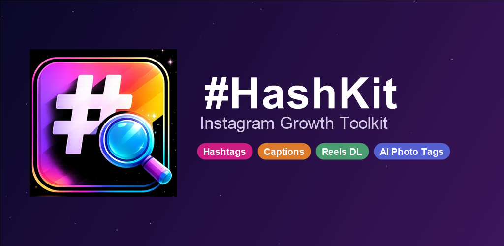
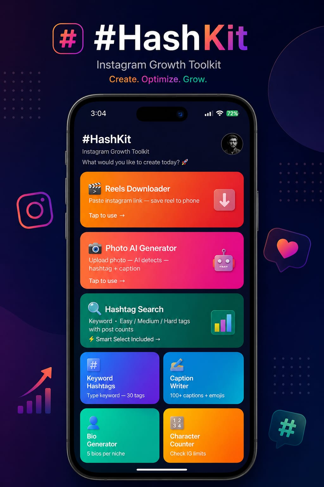
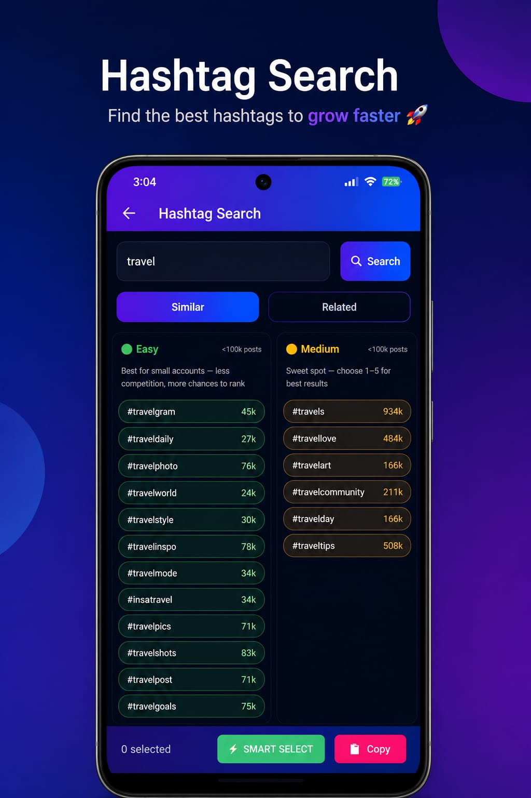

<div align="center">


# #HashKit — Instagram Growth Toolkit

**A native Android toolkit for Instagram creators — hashtag research, on-device AI captioning, and content tools, built with a strong focus on privacy and platform-policy compliance.**

[](https://github.com/mukeshkumar356/hashkit-android/actions/workflows/android-ci.yml)
[](#)
[](#)
[](#)
[](https://play.google.com/store/apps/details?id=com.hashkit.app)
[](LICENSE)



</div>

---

## Overview

HashKit is a full native Android app (no Flutter/React Native) with **8 independent tools** aimed at Instagram creators — hashtag generation, on-device photo analysis, caption/bio writing, and a link-based reel downloader. It's live on the Play Store with **zero ads, zero login, and zero personal data collection.**

## ✨ Features

| Tool | What it does |
|---|---|
| 🏷️ **Hashtag Search** | Keyword → Easy / Medium / Hard hashtags with real post-count difficulty, plus a Smart Select mixer |
| 🔑 **Keyword Hashtags** | Keyword → 30 ready-to-use hashtags instantly |
| 📸 **Photo AI Generator** | On-device ML Kit image labeling suggests a caption + hashtags for any photo — **the photo never leaves the device** |
| ✍️ **Caption Writer** | 100+ curated captions across niches |
| 👤 **Bio Generator** | 5 bio templates per niche |
| 🔢 **Character Counter** | Validate caption/bio length against Instagram's limits |
| 🔥 **Trending Tags** | Browse trending hashtags by category (fully offline) |
| 🎬 **Reels Downloader** | Paste a public Instagram Reel/post link, save it locally |

## 📱 Screenshots

<p align="center">
  
  
  
</p>

## 🛠️ Tech Stack

- **Language:** Java
- **UI:** Native Android Views + Material Components, `ConstraintLayout`
- **ML:** [Google ML Kit — Image Labeling](https://developers.google.com/ml-kit) (on-device, offline)
- **Media selection:** [Android Photo Picker](https://developer.android.com/training/data-storage/shared/photopicker) (`ActivityResultContracts.PickVisualMedia`) — no storage permissions requested
- **Networking:** plain `HttpURLConnection` + a public link-resolving API for the Reels Downloader
- **Build:** Gradle (AGP 8.9), R8 minification + resource shrinking on release builds

## 🔒 Security & Privacy Engineering

Two decisions worth calling out, since they shaped real product tradeoffs:

1. **No broad media permissions.** Early builds requested `READ_MEDIA_IMAGES` for the photo picker. Since the app only ever needs a single user-selected photo, it was migrated to the **Android Photo Picker API**, which needs *zero* runtime permissions and satisfies Google Play's Photos & Videos Permissions policy — this is also exactly what got a previous submission rejection resolved.
2. **Removed a credential-harvesting pattern.** The Reels Downloader originally asked users to log in to their real Instagram account inside an in-app WebView, capturing the session cookie to fetch content. That's a real security anti-pattern (and an Instagram ToS violation) regardless of intent, so it was replaced with a **public-link-only** flow (a public link-resolving API + a direct public-page fetch) — no login, no session data, same feature, none of the risk.

## 🚀 Build it yourself

```bash
git clone https://github.com/mukeshkumar356/hashkit-android.git
cd hashkit-android
cp keystore.properties.example keystore.properties   # fill in your own signing details (optional, debug builds work without it)
./gradlew assembleDebug
```

Release signing is intentionally kept out of the repo — see `keystore.properties.example`.

## 📄 License

MIT — see [LICENSE](LICENSE).

---

<div align="center">

Built and maintained by **[Mukesh Kumar](https://github.com/mukeshkumar356)**

</div>
